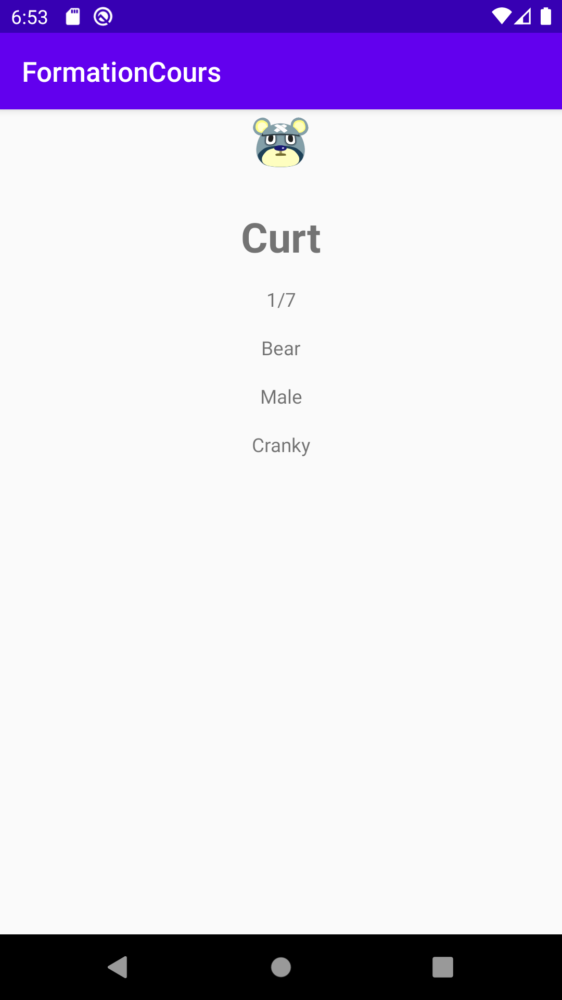
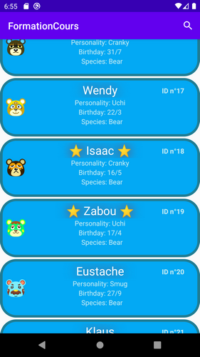
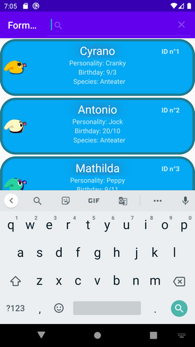

# FormationCours Programmation Mobile - Thomas CARPENTIER 3A-UFA
Projet de formation pour le cours ESIEA
## Introduction

Animal crossing est un jeu de simulation de vie où on évolue dans notre environnement dans un village ou comme dernièrement dans le dernier jeu sorti en avril (?) 2020, sur une île.

Le joueur cohabite avec ses voisins, des animaux anthropomorphes. Ces derniers peuvent décider d'emménager ou de quitter l'île, il devient donc intéressant pour le joueur de connaître une liste de ces habitants et de les répertorier pour pouvoir en faire une wishlist.

Mon application porte donc sur ce sujet, elle utilise l'API ACNHAPI pour récupérer ces villageois, les lister, classer, filtrer.

## Consignes respectées

 - affichage d'une liste
 - second écran détail d'un élément
 - appel API
 - stockage en cache
 - Autres :
     - Mise en favoris
     - Recherche implémentée mais ne se répercute pas sur la vue

## Fonctionnalités

Les fonctionnalités de l'application sont :
 - affichage de la liste complète des villageois du jeu
 
 
 - affichage de la vue détaillée d'un villageois en appuyant sur son nom
 
 
 - marquer en favoris un villageois en appuyant sur son icone à gauche dans la liste
 

Non fonctionnelles :
 - recherche d'un villageois grâce à son nom (mais ne fonctionne pas)
 
 
 ## Difficultés
 
 L'API que j'ai utilisée me retournait, pour la liste de tous les villageois, une liste avec des intitulés différents à chaque nouvel item, débutant avec le JSON avec ce projet je ne suis pas parvenu à placer cette liste dans des objets avec Retrofit.
 
 J'ai donc utilisé une requête de type HttpURLConnection pour récupérer le JSON souhaité et récupérer ensuite les objets avec Gson.
 
 ## Démonstration vidéo
 Pour une démo plus vivante, voici une vidéo de démonstration de l'application : https://youtu.be/xbqZ_XVPxKw
 
 Vous trouverez les timecodes correspondant à la démonstration de chaque fonctionnalité dans la description de la vidéo.
