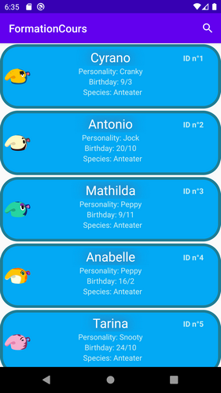

# FormationCours Programmation Mobile - Thomas CARPENTIER 3A-UFA
Projet de formation pour le cours ESIEA
## Introduction

Animal crossing est un jeu de simulation de vie où on évolue dans notre environnement dans un village ou comme dernièrement dans le dernier jeu sorti en avril (?) 2020, sur une île.

Le joueur cohabite avec ses voisins, des animaux anthropomorphes. Ces derniers peuvent décider d'emménager ou de quitter l'île, il devient donc intéressant pour le joueur de connaître une liste de ces habitants et de les répertorier pour pouvoir en faire une wishlist.

Mon application porte donc sur ce sujet, elle utilise l'API ACNHAPI pour récupérer ces villageois, les lister, classer, filtrer.

## Fonctionnalités

Les fonctionnalités de l'application sont :
 - affichage de la liste complète des villageois du jeu
 
 - affichage de la vue détaillée d'un villageois
 - marquer en favoris un villageois

Non fonctionnelles :
 - recherche d'un villageois grâce à son nom (mais ne fonctionne pas)
